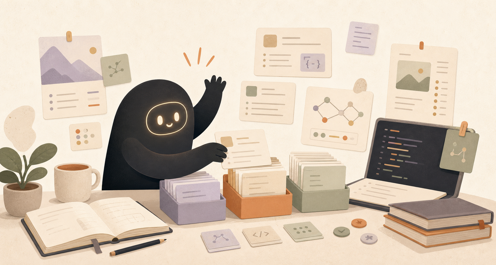

  

<h1 align="center">Good Stuff for Agents</h1>

<strong>I’m collecting the good stuff for agents: useful skills, trustworthy sources, and ready-to-run packs.</strong>

  
  
  
  

  

## Hi, I’m sorting the shelf.

I’m turning public agent skills into a friendly field guide: quick routes when you know the job, individual skills when you want the pieces, and source trails when you want to check where something came from.

I try to keep it bright and useful: less rummaging through raw lists, more “start here, this should help.”

## Start here

<table>
  <tr>
    <td><strong><a href="docs/packs/README.md">Packs</a></strong> Prepared routes for complete agent tasks.</td>
    <td><strong><a href="docs/skills/README.md">Skills</a></strong> Individual capabilities with scope, evidence, and caveats.</td>
  </tr>
  <tr>
    <td><strong><a href="docs/sources/README.md">Sources</a></strong> The public projects behind the shelves.</td>
    <td><strong><a href="docs/domains/README.md">Domains</a></strong> Problem-space maps when you want to browse by task.</td>
  </tr>
</table>

## Packs I’ve put on the shelf

These are ready routes, not piles of loose parts.

| Pack | What I made it for | Confidence |
| --- | --- | --- |
| [Frontend Design and Review](docs/packs/frontend-design/pck_frontend-design-and-review.md) | Turning fuzzy UI requests into polished, opinionated, reviewable interfaces. | 79% confidence · Ready to use |
| [Fullstack Coding Agent Workflow](docs/packs/coding-agent-workflow/pck_fullstack-coding-agent-workflow.md) | Moving a coding agent from plan to release with checks along the way. | 82% confidence · Ready to use |

## Browse by domain

- [Coding Agent Workflow](docs/domains/coding-agent-workflow.md) · 1 packs · 0 skills
- [Frontend Design](docs/domains/frontend-design.md) · 1 packs · 0 skills
