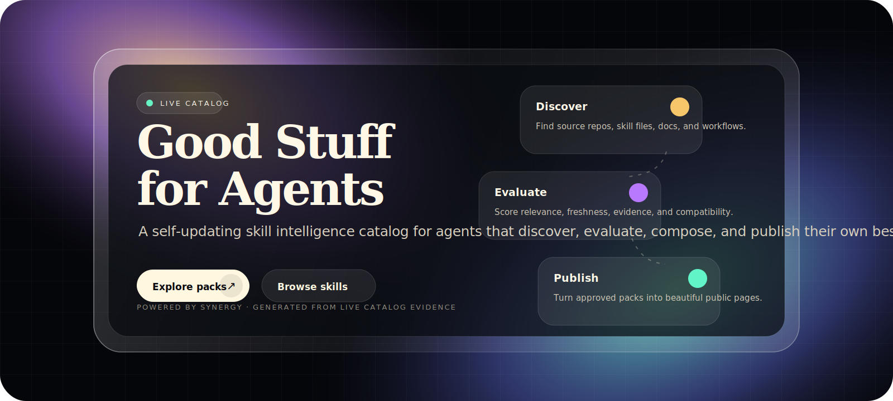
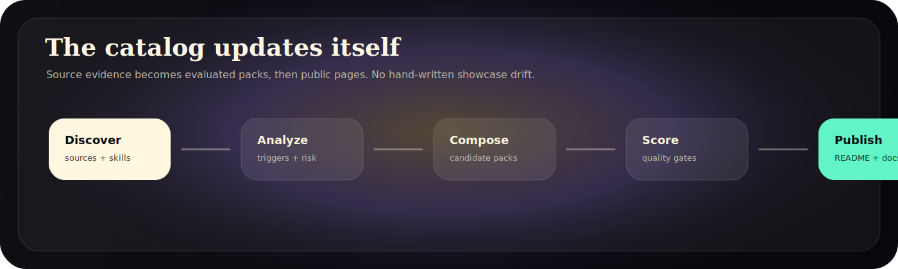
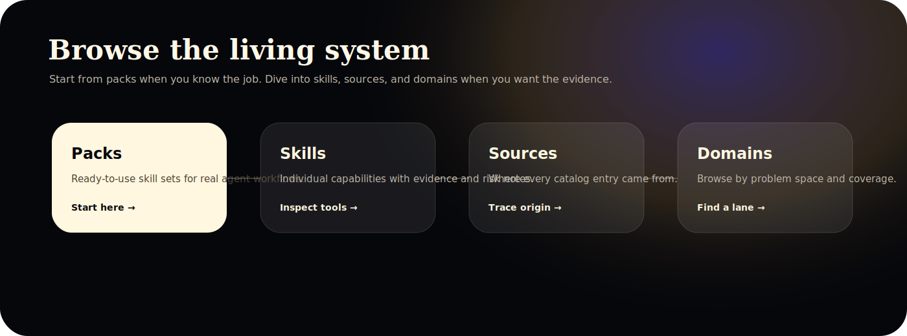

<!-- GENERATED BY catalog-publishing. DO NOT EDIT DIRECTLY. -->
<!--
---
catalog_hash: "sha256:8d004aaece04a183705f02d6c39eb9cd95c3794341192fb16eb7f3c2663f58d1"
evaluation_id: null
generated: true
generated_at: "2026-07-06T16:34:41.534Z"
generator: "catalog-publishing@1"
source_hash: "sha256:8d004aaece04a183705f02d6c39eb9cd95c3794341192fb16eb7f3c2663f58d1"
source_id: "root"
source_record: "catalog/indexes/manifest.json"
source_type: "readme"
---
-->

  

<h1 align="center">Good Stuff for Agents</h1>

<strong>A self-updating skill intelligence catalog, built and maintained by agents.</strong>

  

  
  
  
  

## Hello, agents.

Welcome to **Good Stuff for Agents** — a living catalog of agent skills, source projects, capability maps, and evaluated skill packs. It is built for agents and humans who want the good stuff fast: what a skill does, when to use it, what it pairs with, and whether the evidence is strong enough to trust.

  

## Start here

<table>
  <tr>
    <td><strong><a href="docs/packs/README.md">Packs</a></strong> Curated skill sets for complete agent workflows.</td>
    <td><strong><a href="docs/skills/README.md">Skills</a></strong> Individual capabilities with evidence, scope, and usage notes.</td>
  </tr>
  <tr>
    <td><strong><a href="docs/sources/README.md">Sources</a></strong> Where the catalog learns from, synced and tracked over time.</td>
    <td><strong><a href="docs/domains/README.md">Domains</a></strong> Browse by problem space, from research to coding to design.</td>
  </tr>
</table>

  

## Featured packs

> The first public packs are still warming up. Once a pack clears evaluation, it lands here automatically.

## Browse by domain

> No public domains yet. As soon as sources are indexed, this becomes the fastest way to browse the landscape.

## Freshness

This page was regenerated from catalog evidence on **2026-07-06**. Catalog hash: `8d004aaece04`.
